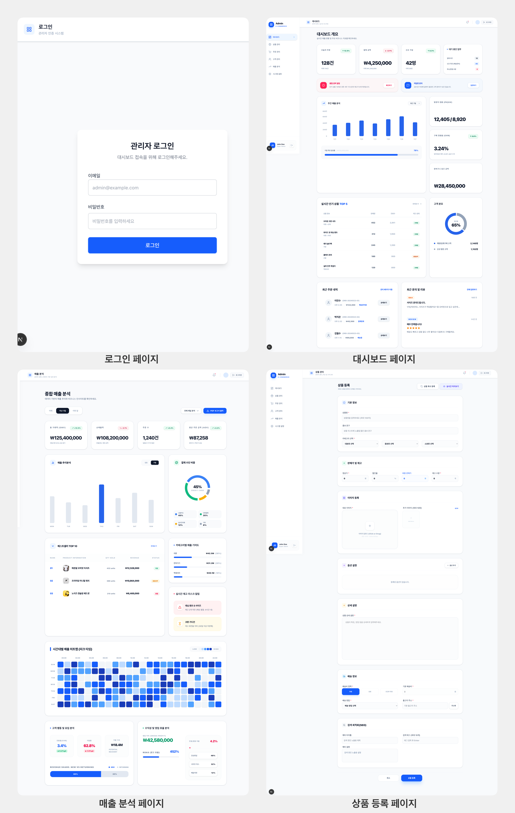
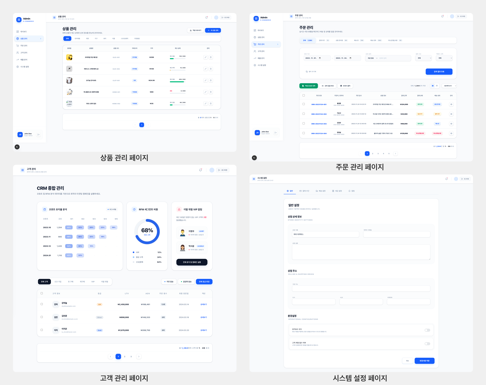

# 🚀 Premium E-Commerce Admin Dashboard

> **Next.js 15, Supabase, 및 Clean Architecture를 활용한 고성능 이커머스 관리자 플랫폼**

본 프로젝트는 현대적인 웹 기술 스택을 활용하여 구축된 프리미엄 이커머스 대시보드입니다. **Clean Architecture (Feature-Sliced Design)** 를 기반으로 설계되어 유지보수성과 확장성이 뛰어나며, 실시간 데이터 연동과 세련된 UI/UX를 제공합니다.

---

## 📸 Preview



---

## ✨ Key Features

### 📊 대시보드 & 통계 (Analytics)
- **동적 차트**: Recharts를 활용한 매출 추이 및 판매 통계 시각화.
- **핵심 지표 요약**: 당일 매출, 신규 주문, 재고 상태 등 주요 지표 실시간 대시보드.

### 📦 상품 관리 (Product Management)
- **스마트 등록 폼**: TanStack Form과 Zod를 활용한 강력한 유효성 검사. (0원 차단, 실시간 이미지 에러 피드백 등)
- **멀티 이미지 업로드**: Supabase Storage 연동 및 드래그 앤 드롭 지원.
- **실시간 데이터 연동**: Supabase DB를 통한 상품 목록 조회, 검색 및 필터링.

### 🧾 주문 관리 (Order Management)
- **상세 내역 조회**: 주문 상품, 결제 정보, 배송 상태를 한눈에 파악.
- **배송 상태 제어**: 직관적인 UI를 통한 주문 상태 업데이트 및 실시간 반영.

### 👥 고객 관리 (Customer Management)
- **회원 정보 통합 관리**: 가입일, 총 구매 금액 등 고객별 상세 프로필 및 종합 서머리 제공.
- **등급 및 혜택 관리**: 구매 실적에 따른 회원 등급 산정 및 등급별 맞춤형 혜택 부여 지원.

### 🔎 매출 분석 (Sales Analysis)
- **데이터 시각화**: Recharts를 활용하여 일간/주간/월간 매출 추이를 직관적인 차트로 시각화.
- **성과 지표 분석**: 총 매출액, 주문 건수, 평균 주문 금액 등 핵심 비즈니스 KPI 실시간 집계.
- **카테고리별 매출**: 상품 카테고리별 판매 비중을 분석하여 재고 관리 및 마케팅 전략 수립 지원.

### ⚙️ 시스템 설정 (System Settings)
- **탭 기반 레이아웃**: 일반, 결제, 배송 등 복잡한 설정을 직관적인 탭 UI로 통합 관리.

---

## 🏗️ Architecture: Clean Architecture (FSD)

이 프로젝트는 **Feature-Sliced Design (FSD)** 기반의 클린 아키텍처를 준수합니다.

```text
src/
├── features/           # 도메인 중심의 기능별 슬라이스
│   ├── product/        # 상품 도메인 (domain, application, infrastructure, presentation)
│   ├── order/          # 주문 도메인
│   └── ...
├── shared/             # 전역 공통 모듈 (UI, API, lib, types)
└── app/                # Next.js App Router (Composition Root)
```

### 레이어별 역할
- **Domain**: 순수 비즈니스 로직 및 엔티티 (Framework 독립적).
- **Application**: 유즈케이스 구현.
- **Infrastructure**: 외부 API 및 DB(Supabase) 연동체.
- **Presentation**: React 컴포넌트 및 클라이언트 상태 관리.

---

## 🛠️ Tech Stack

- **Framework**: Next.js 15 (App Router)
- **Language**: TypeScript
- **Database**: Supabase (PostgreSQL)
- **Storage**: Supabase Storage
- **Auth**: Supabase Auth
- **Forms**: TanStack Form + Zod
- **Styling**: Tailwind CSS
- **Charts**: Recharts
- **Icons**: Lucide React

---

## 🚀 Getting Started

### 1. 환경 변수 설정
`.env.local` 파일을 생성하고 Supabase 자격 증명을 입력합니다.
```env
NEXT_PUBLIC_SUPABASE_URL=your_supabase_url
NEXT_PUBLIC_SUPABASE_ANON_KEY=your_supabase_anon_key
```

### 2. 패키지 설치 및 실행
```bash
npm install
npm run dev
```

---

## ✅ Quality Assurance

- **TDD (Test Driven Development)**: Vitest를 활용한 핵심 비즈니스 로직 단위 테스트 수행.
- **UX/UI Center**: 다크모드 대응, 애니메이션 최적화, 모바일 반응형 완벽 지원.
- **Performance**: SSR(Server Side Rendering) 및 이미지 최적화(`next/image`)를 통한 빠른 로딩 속도.
